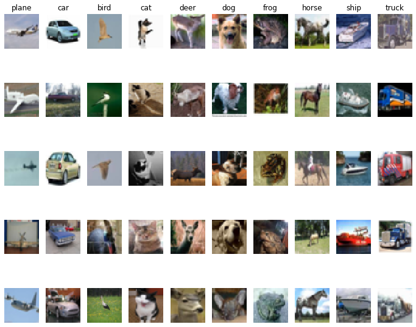
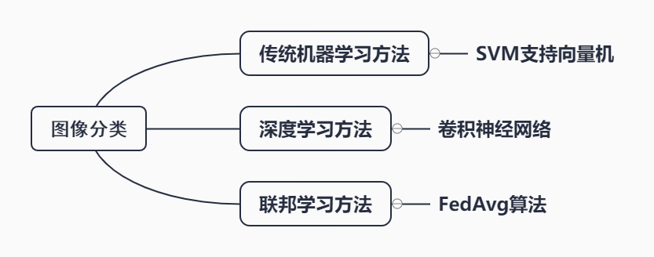
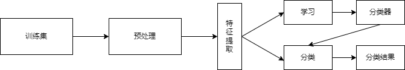
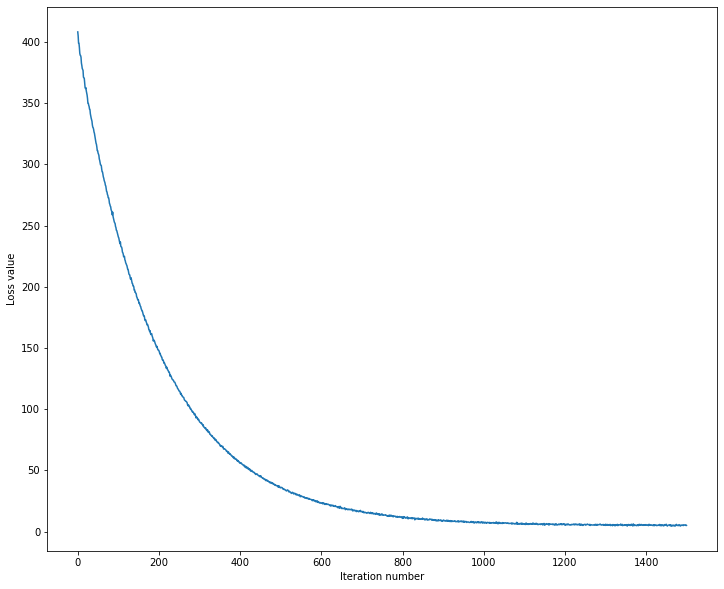
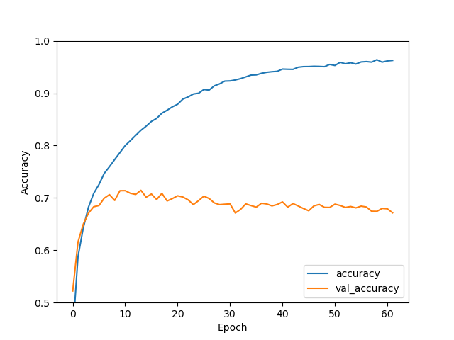
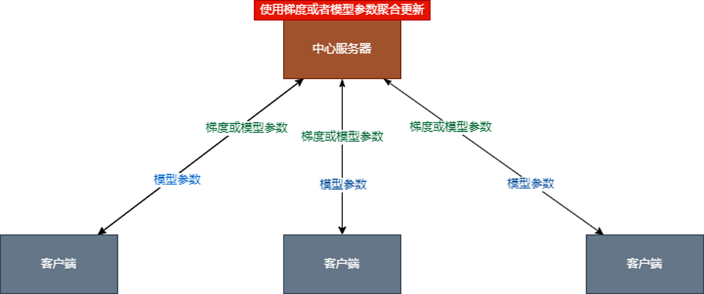
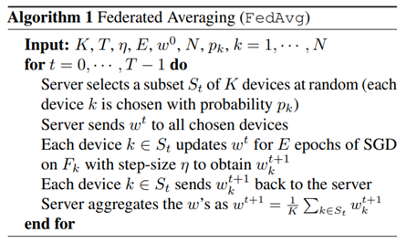
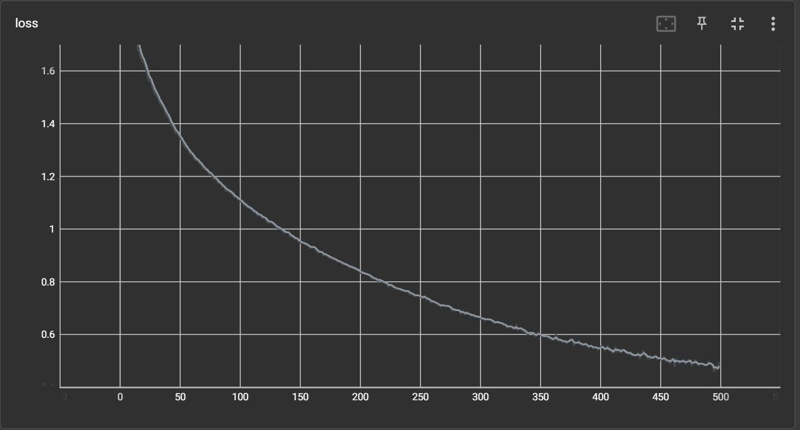
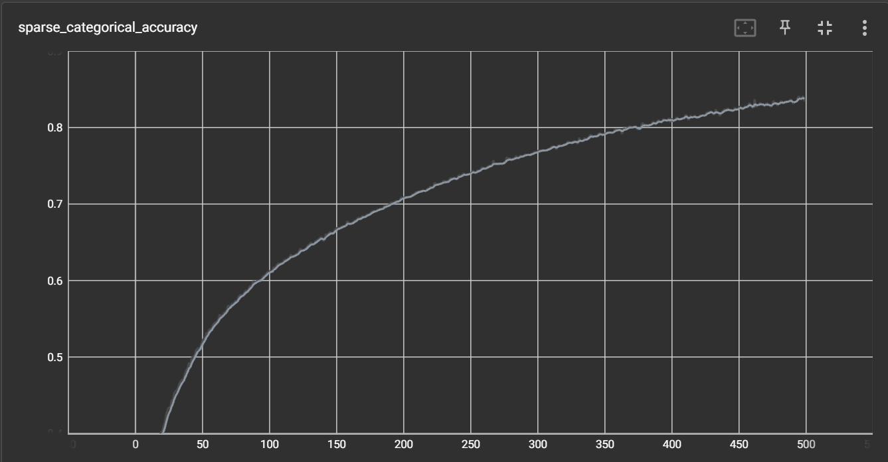

# 实验二：图像分类实验

## 一、概要

### 1.图像分类

图像分类，根据各自在图像信息中所反映的不同特征，把不同类别的目标区分开来的图像处理方法。它利用计算机对图像进行定量分析，把图像或图像中的每个像元或区域划归为若干个类别中的某一种，以代替人的视觉判读。

### 2.CIFAR-10 数据集简介

CIFAR-10 是由 Hinton 的学生 Alex Krizhevsky 和 Ilya Sutskever 整理的一个用于识别普适物体的小型数据集。一共包含 10 个类别的 RGB 彩色图 片：飞机（ airplane ）、汽车（ automobile ）、鸟类（ bird ）、猫（ cat ）、鹿（ deer ）、狗（ dog ）、蛙类（ frog ）、马（ horse ）、船（ ship ）和卡车（ truck ）。图片的尺寸为 32×32 ，数据集中一共有 50000 张训练图片和 10000 张测试图片。

下面这幅图就是列举了10各类，每一类展示了随机的10张图片：



与 MNIST 数据集中目比， CIFAR-10 具有以下不同点：

- CIFAR-10 是 3 通道的彩色 RGB 图像，而 MNIST 是灰度图像。

- CIFAR-10 的图片尺寸为 32×32， 而 MNIST 的图片尺寸为 28×28，比 MNIST 稍大。

- 相比于手写字符， CIFAR-10 含有的是现实世界中真实的物体，不仅噪声很大，而且物体的比例、 特征都不尽相同，这为识别带来很大困难。 直接的线性模型如 Softmax 在 CIFAR-10 上表现得很差。

  

## 二、实验工具

### 1.Numpy

**Numpy** 的英文全称为 **Numerical Python**，指Python 面向数值计算的第三方库。Numpy 的特点在于，针对 Python 内建的数组类型做了扩充，支持更高维度的数组和矩阵运算，以及更丰富的数学函数。Numpy 是 Scipy.org 中最重要的库之一，它同时也被 Pandas，Matplotlib 等我们熟知的第三方库作为核心计算库。
NumPy（Numeric Python）提供了许多高级的数值编程工具，如：矩阵数据类型、矢量处理，以及精密的运算库。专为进行严格的数字处理而产生。多为很多大型金融公司使用，以及核心的科学计算组织如：Lawrence Livermore，NASA用其处理一些本来使用C++，Fortran或Matlab等所做的任务。

#### **版本**

1.20.3

### 2.Tensorflow

**TensorFlow** 是一个端到端开源机器学习平台。一经发布，就受到了广泛的关注，并在计算机视觉、音频处理、推荐系统和自然语言处理等场景下都被大面积推广使用，它托管在github平台，有google groups和contributors共同维护，提供了丰富的深度学习相关的API，支持Python和C/C++接口，提供了可视化分析工具Tensorboard，方便分析和调整模型。

#### 版本

2.10.0

### 3.Tensorflow_Federated(TFF)

**TensorFlow Federated** (TFF) 是一个开源框架，用于对分散式数据进行机器学习和其他计算。 TFF 是为了促进联邦学习的开放式研究和实验。FL 是一种机器学习方法，使我们能够跨多个参与客户端训练全局共享的模型，并让训练数据留存在本地。例如，FL 已被用于训练手机键盘的预测模型，但不会将敏感的输入数据上传到服务器。

利用 TFF，开发者可基于其模型和数据来模拟所包含的联邦学习算法，还可实验新算法。TFF 提供的构建块也可用于实现非学习计算，例如对分散式数据进行聚合分析。

借助 TFF，开发者能够以声明方式表达联邦计算，从而将它们部署到不同的运行时环境中。TFF 包含一个用于实验的单机模拟运行。

#### 版本


## 三、实验步骤



本实验从机器学习发展路线进行试验，从最早的传统**机器学习**方法到**深度学习**，再到**联邦学习**方法。

### 1.传统机器学习方法

**机器学习**是一门多领域交叉学科，涉及概率论、统计学、逼近论、凸分析、算法复杂度理论等多门学科。专门研究计算机怎样模拟或实现人类的学习行为，以获取新的知识或技能，重新组织已有的知识结构使之不断改善自身的性能。

#### 1.1 SVM支持向量机

支持向量机（`support vector machines`，`SVM`）是一种二分类模型，它的目的是寻找一个超平面来对样本进行分割，分割的原则是间隔最大化，最终转化为一个凸二次规划问题来求解。由简至繁的模型包括：

- 当训练样本**线性可分**时，通过**硬间隔最大化**，学习一个**线性可分支持向量机**
- 当训练样本**近似线性可分**时，通过**软间隔最大化**，学习一个**线性支持向量机**
- 当训练样本**线性不可分**时，通过**核技巧和软间隔最大化**，学习一个**非线性支持向量机**



##### 1.1.1数据导入

```python
def load_pickle(f):
    version = platform.python_version_tuple()
    if version[0] == '2':
        return  pickle.load(f)
    elif version[0] == '3':
        return  pickle.load(f, encoding='latin1')
    raise ValueError("invalid python version: {}".format(version))

def load_CIFAR_batch(filename):
    """ load single batch of cifar """
    with open(filename, 'rb') as f:
        datadict = load_pickle(f)
        X = datadict['data']
        Y = datadict['labels']
        X = X.reshape(10000, 3, 32, 32).transpose(0,2,3,1).astype("float")
        Y = np.array(Y)
        return X, Y

def load_CIFAR10(ROOT):
    """ load all of cifar """
    xs = []
    ys = []
    for b in range(1,6):
        f = os.path.join(ROOT, 'data_batch_%d' % (b, ))
        X, Y = load_CIFAR_batch(f)
        xs.append(X)
        ys.append(Y)    
    Xtr = np.concatenate(xs)
    Ytr = np.concatenate(ys)
    del X, Y
    Xte, Yte = load_CIFAR_batch(os.path.join(ROOT, 'test_batch'))
    return Xtr, Ytr, Xte, Yte
    
    
# Load the raw CIFAR-10 data.
cifar10_dir = '../data/'
X_train, y_train, X_test, y_test = load_CIFAR10(cifar10_dir)

# As a sanity check, we print out the size of the training and test data.
print('Training data shape: ', X_train.shape)
print('Training labels shape: ', y_train.shape)
print('Test data shape: ', X_test.shape)
print('Test labels shape: ', y_test.shape)`
```

结果：

```
Training data shape:  (50000, 32, 32, 3)
Training labels shape:  (50000,)
Test data shape:  (10000, 32, 32, 3)
Test labels shape:  (10000,)
```

##### 1.1.2数据预处理

将训练集中的1000条取出用作验证集，将3维图片展开`32*32*3`转为一维3072

```python

num_training = 49000
num_validation = 1000
num_test = 10000
num_dev = 500


mask = range(num_training, num_training + num_validation)
X_val = X_train[mask]
y_val = y_train[mask]


mask = range(num_training)
X_train = X_train[mask]
y_train = y_train[mask]


mask = np.random.choice(num_training, num_dev, replace=False)
X_dev = X_train[mask]
y_dev = y_train[mask]


mask = range(num_test)
X_test = X_test[mask]
y_test = y_test[mask]

X_train = np.reshape(X_train, (X_train.shape[0], -1))
X_val = np.reshape(X_val, (X_val.shape[0], -1))
X_test = np.reshape(X_test, (X_test.shape[0], -1))
X_dev = np.reshape(X_dev, (X_dev.shape[0], -1))

print('Training data shape: ', X_train.shape)
print('Validation data shape: ', X_val.shape)
print('Test data shape: ', X_test.shape)
print('dev data shape: ', X_dev.shape)
```

输出结果如下

```
Training data shape:  (49000, 3072)
Validation data shape:  (1000, 3072)
Test data shape:  (10000, 3072)
dev data shape:  (500, 3072)
```

图片减去均值，加上偏置b

```
X_train -= mean_image
X_val -= mean_image
X_test -= mean_image
X_dev -= mean_image

X_train = np.hstack([X_train, np.ones((X_train.shape[0], 1))])
X_val = np.hstack([X_val, np.ones((X_val.shape[0], 1))])
X_test = np.hstack([X_test, np.ones((X_test.shape[0], 1))])
X_dev = np.hstack([X_dev, np.ones((X_dev.shape[0], 1))])
```

##### 1.1.3SVM分类器

```python
class LinearSVM:
    def __init__(self):
        self.W = None
    
    def loss(self, X, y, reg):
        """
        Structured SVM loss function, vectorized implementation.

        Inputs and outputs are the same as svm_loss_naive.
        """
        loss = 0.0
        dW = np.zeros(self.W.shape) # initialize the gradient as zero

        num_train = X.shape[0]
        scores = X.dot(self.W)
        correct_class_score = scores[range(num_train), list(y)].reshape(-1,1) # (N,1)
        margin = np.maximum(0, scores - correct_class_score + 1)
        margin[range(num_train), list(y)] = 0
        loss = np.sum(margin) / num_train + 0.5 * reg * np.sum(self.W * self.W)
  
        num_classes = self.W.shape[1]
        inter_mat = np.zeros((num_train, num_classes))
        inter_mat[margin > 0] = 1
        inter_mat[range(num_train), list(y)] = 0
        inter_mat[range(num_train), list(y)] = -np.sum(inter_mat, axis=1)

        dW = (X.T).dot(inter_mat)
        dW = dW/num_train + reg*self.W

        return loss, dW
    
    def train(self, X, y, learning_rate=1e-3, reg=1e-5, num_iters=100,
            batch_size=200, verbose=False):
        """
        Train this linear classifier using stochastic gradient descent.

        Inputs:
        - X: A numpy array of shape (N, D) containing training data; there are N
          training samples each of dimension D.
        - y: A numpy array of shape (N,) containing training labels; y[i] = c
          means that X[i] has label 0 <= c < C for C classes.
        - learning_rate: (float) learning rate for optimization.
        - reg: (float) regularization strength.
        - num_iters: (integer) number of steps to take when optimizing
        - batch_size: (integer) number of training examples to use at each step.
        - verbose: (boolean) If true, print progress during optimization.

        Outputs:
        A list containing the value of the loss function at each training iteration.
        """
        num_train, dim = X.shape
        num_classes = np.max(y) + 1 # assume y takes values 0...K-1 where K is number of classes
        if self.W is None:
            # lazily initialize W
            self.W = 0.001 * np.random.randn(dim, num_classes)

        # Run stochastic gradient descent to optimize W
        loss_history = []
        for it in range(num_iters):
            X_batch = None
            y_batch = None
            idx_batch = np.random.choice(num_train, batch_size, replace = True)
            X_batch = X[idx_batch]
            y_batch = y[idx_batch]

            # evaluate loss and gradient
            loss, grad = self.loss(X_batch, y_batch, reg)
            loss_history.append(loss)

            self.W -=  learning_rate * grad

            if verbose and it % 100 == 0:
                print('iteration %d / %d: loss %f' % (it, num_iters, loss))

        return loss_history
    
    def predict(self, X):
        """
        Use the trained weights of this linear classifier to predict labels for
        data points.

        Inputs:
        - X: A numpy array of shape (N, D) containing training data; there are N
          training samples each of dimension D.

        Returns:
        - y_pred: Predicted labels for the data in X. y_pred is a 1-dimensional
          array of length N, and each element is an integer giving the predicted
          class.
        """
        y_pred = np.zeros(X.shape[0])
        scores = X.dot(self.W)
        y_pred = np.argmax(scores, axis = 1)
        return y_pred
```

##### 1.1.4训练

```
iteration 0 / 1500: loss 408.176420
iteration 100 / 1500: loss 240.627304
iteration 200 / 1500: loss 147.727861
iteration 300 / 1500: loss 89.667393
iteration 400 / 1500: loss 55.956620
iteration 500 / 1500: loss 35.822380
iteration 600 / 1500: loss 23.368465
iteration 700 / 1500: loss 16.409217
iteration 800 / 1500: loss 10.876072
iteration 900 / 1500: loss 9.186121
iteration 1000 / 1500: loss 7.339409
iteration 1100 / 1500: loss 5.999163
iteration 1200 / 1500: loss 6.036436
iteration 1300 / 1500: loss 6.095452
iteration 1400 / 1500: loss 5.664839
That took 3.887202s
```



训练准确率：

```
training accuracy: 0.383755
validation accuracy: 0.386000
```

交叉验证，进一步选择最合适的参数

##### 1.1.5测试集验证

最终测试集准确率为：

```
linear SVM on raw pixels final test set accuracy: 0.388600
```

### 2.深度学习方法

深度学习(DL, Deep Learning)是机器学习(ML, Machine Learning)领域中一个新的研究方向，它被引入机器学习使其更接近于最初的目标——人工智能(AI, Artificial Intelligence)。 

深度学习是学习样本数据的内在规律和表示层次，这些学习过程中获得的信息对诸如文字，图像和声音等数据的解释有很大的帮助。它的最终目标是让机器能够像人一样具有分析学习能力，能够识别文字、图像和声音等数据。 深度学习是一个复杂的机器学习算法，在语音和图像识别方面取得的效果，远远超过先前相关技术。 

深度学习在搜索技术，数据挖掘，机器学习，机器翻译，自然语言处理，多媒体学习，语音，推荐和个性化技术，以及其他相关领域都取得了很多成果。深度学习使机器模仿视听和思考等人类的活动，解决了很多复杂的模式识别难题，使得人工智能相关技术取得了很大进步。

#### 1.卷积神经网络

卷积神经网络（Convolutional Neural Networks, CNN）是一类包含卷积计算且具有深度结构的前馈神经网络（Feedforward Neural Networks），是深度学习（deep learning）的代表算法之一  。卷积神经网络具有表征学习（representation learning）能力，能够按其阶层结构对输入信息进行平移不变分类（shift-invariant classification），因此也被称为“平移不变人工神经网络（Shift-Invariant Artificial Neural Networks, SIANN）”  。

对卷积神经网络的研究始于二十世纪80至90年代，时间延迟网络和LeNet-5是最早出现的卷积神经网络 ；在二十一世纪后，随着深度学习理论的提出和数值计算设备的改进，卷积神经网络得到了快速发展，并被应用于计算机视觉、自然语言处理等领域  。

卷积神经网络仿造生物的视知觉（visual perception）机制构建，可以进行监督学习和非监督学习，其隐含层内的卷积核参数共享和层间连接的稀疏性使得卷积神经网络能够以较小的计算量对格点化（grid-like topology）特征，例如像素和音频进行学习、有稳定的效果且对数据没有额外的特征工程（feature engineering）要求  。

**定义**：采用监督方式训练的一种面向两维形状不变性识别的特定多层感知机

在卷积神经网络部分，使用**Tensorflow**机器学习框架，辅助实验。

##### 1.1数据导入、预处理

Tensorflow提供了CIFAR10的数据集，可以直接使用`tensorflow.keras.datasets.cifar10.load_data()`函数读入

预处理采用归一化

```
(train_images, train_labels), (test_images, test_labels) = datasets.cifar10.load_data()
train_images, test_images = train_images / 255.0, test_images / 255.0
```

##### 1.2卷积模型

模型生成部分，采用`tensorflow.keras.models.Sequential()`

```python
model = models.Sequential()
model.add(layers.Conv2D(32, (3, 3), activation='relu', input_shape=(32, 32, 3)))
model.add(layers.MaxPooling2D((2, 2)))
model.add(layers.Conv2D(64, (3, 3), activation='relu'))
model.add(layers.MaxPooling2D((2, 2)))
model.add(layers.Conv2D(64, (3, 3), activation='relu'))
model.add(layers.Flatten())
model.add(layers.Dense(64, activation='relu'))
model.add(layers.Dense(10))
```

**模型架构**:

```
Model: "sequential"
_________________________________________________________________
 Layer (type)                Output Shape              Param #   
=================================================================
 conv2d (Conv2D)             (None, 30, 30, 32)        896       
                                                                 
 max_pooling2d (MaxPooling2D  (None, 15, 15, 32)       0         
 )                                                               
                                                                 
 conv2d_1 (Conv2D)           (None, 13, 13, 64)        18496     
                                                                 
 max_pooling2d_1 (MaxPooling  (None, 6, 6, 64)         0         
 2D)                                                             
                                                                 
 conv2d_2 (Conv2D)           (None, 4, 4, 64)          36928     
                                                                 
 flatten (Flatten)           (None, 1024)              0         
                                                                 
 dense (Dense)               (None, 64)                65600     
                                                                 
 dense_1 (Dense)             (None, 10)                650       
                                                                 
=================================================================
Total params: 122,570
Trainable params: 122,570
Non-trainable params: 0
_________________________________________________________________
```

输入形状为（32, 32, 3）通过卷积层以及池化层进行特征提取，再通过Flatten层降维，全连接层进行拟合，最终输出10个结果来代表预测结果，模型的具体信息可以通过上表看出。总共需要计算的参数有122570个。

##### 1.3训练

训练部分采取`tensorflow.keras.model.comple()`函数进行编译，`tensorflow.keras.model.fit()`进行训练。

在具体训练过程采取了`EarlyStopping`方法，可以自动停止训练，停止的条件是连续三轮损失函数没有下降。

参数的优化方法选择了`adam`效果要比传统的`SGD`方法好。

```python
model.compile(optimizer='adam',
              loss=tf.keras.losses.SparseCategoricalCrossentropy(from_logits=True),
              metrics=['accuracy'],
              )
callback = tf.keras.callbacks.EarlyStopping(monitor = 'loss',patience=3)
history = model.fit(train_images, train_labels, epochs=200,
                    validation_data=(test_images, test_labels),
                    callbacks = [callback])
```

**训练结果**



卷积神经网络不断地训练优化参数，对于训练集的结果拟合的非常好，但对于验证集的结果差距很大，训练集最优的准确率可以达到 `0.9607`，但验证集结果仅为`0.7101`，从上图以及我多次实验总结到，该模型其实在10轮左右的验证集结果与训练为50轮左右的效果相差不大。

##### 1.4测试集测试

最终测试集结果为：

```
313/313 - 1s - loss: 0.9032 - accuracy: 0.6997 - 747ms/epoch - 2ms/step
```

### 3.联邦学习方法

联邦机器学习(Federated machine learning/Federated Learning)，又名联邦学习，联合学习，联盟学习。联邦机器学习是一个机器学习框架，能有效帮助多个机构在满足用户隐私保护、数据安全和政府法规的要求下，进行数据使用和机器学习建模。联邦学习作为分布式的机器学习范式,可以有效解决数据孤岛问题,让参与方在不共享数据的基础上联合建模,能从技术上打破数据孤岛,实现AI协作。谷歌在2016年提出了针对手机终端的联邦学习,微众银行AI团队则从金融行业实践出发,关注跨机构跨组织的大数据合作场景，首次提出“联邦迁移学习”的解决方案，将迁移学习和联邦学习结合起来。据杨强教授在“联邦学习研讨会”上介绍,联邦迁移学习让联邦学习更加通用化,可以在不同数据结构、不同机构间发挥作用，没有领域和算法限制,同时具有模型质量无损、保护隐私、确保数据安全的优势。

形容联邦学习的一句话是：数据不动模型动，数据可用不可见。

这也暗含了联邦学习的优点，它可以打破数据壁垒，保证数据安全，训练的方法类似于分布式机器学习。



本次联邦学习实验采用框架为Tensorflow_Federated(TFF)是专门用来模拟联邦学习的框架，缺点是仅可在linux系统部署。

#### 1.FedAVG算法

FedAVG算法是联邦学习中的经典算法，用在不同设备之间聚合参数。



每个设备在模型训练过程中具有相同的学习率和迭代次数。在每一轮更新中，参与本轮训练的设备在本地运行E轮，每个设备将更新结果返回给服务器，服务器对得到的模型更新进行平均从而获得全局更新，并完成本轮训练。

本实验设置了两个客户机，每个客户机均分训练集数据，参数优化选取`adam`。

##### 1.1数据导入

将50000条训练集均分到了两个设备中，每个设备包含25000条训练数据

```python
def make_client(num_clients, X, y):
    total_image_count = len(X)
    image_per_set = int(np.floor(total_image_count / num_clients))

    client_train_dataset = collections.OrderedDict()
    for i in range(1, num_clients + 1):
        client_name = i - 1
        start = image_per_set * (i - 1)
        end = image_per_set * i

        print(f"Adding data from {start} to {end} for client : {client_name}")
        data = collections.OrderedDict((('label', y[start:end]), ('pixels', X[start:end])))
        client_train_dataset[client_name] = data

    train_dataset = tff.simulation.datasets.TestClientData(client_train_dataset)

    return train_dataset


def make_test(num_clients, X, y):
    client_train_dataset = collections.OrderedDict()
    for i in range(1, num_clients + 1):
        client_name = i - 1
        data = collections.OrderedDict((('label', y), ('pixels', X)))
        client_train_dataset[client_name] = data

    train_dataset = tff.simulation.datasets.TestClientData(client_train_dataset)

    return train_dataset


(X_train, y_train), (X_test, y_test) = datasets.cifar10.load_data()
cifarFedTrain = make_client(NUM_CLIENTS, X_train, y_train)
test = make_test(NUM_CLIENTS, X_test, y_test)


def map_fn(example):
    return collections.OrderedDict(
        x=example['pixels'],
        y=example['label']
    )


def client_data(client_id):
    ds = cifarFedTrain.create_tf_dataset_for_client(cifarFedTrain.client_ids[client_id])
    return ds.repeat(EPOCHS).shuffle(500).batch(BATCH_SIZE).map(map_fn)


def test_data(client_id):
    ds = test.create_tf_dataset_from_all_clients(test.client_ids[client_id])
    return ds.repeat(EPOCHS).shuffle(500).batch(BATCH_SIZE).map(map_fn)


test_data = [test_data(n) for n in range(ROUND_CLIENTS)]
train_data = [client_data(n) for n in range(ROUND_CLIENTS)]
```

##### 1.2模型

联邦学习对于模型的限制不大，突出对比实验，联邦学习的模型采用与深度学习方法相同的卷积模型。

```python

def create_keras_model():
    model = models.Sequential()
    model.add(layers.Conv2D(32, (3, 3), activation='relu', input_shape=(32, 32, 3)))
    model.add(layers.MaxPooling2D((2, 2)))
    model.add(layers.Conv2D(64, (3, 3), activation='relu'))
    model.add(layers.MaxPooling2D((2, 2)))
    model.add(layers.Conv2D(64, (3, 3), activation='relu'))
    model.add(layers.Flatten())
    model.add(layers.Dense(64, activation='relu'))
    model.add(layers.Dense(10))
    return model
```

##### 1.3训练

FedAVG算法用于训练过程，他将每轮设备之间的权重参数进行收集，拟合，分发。联邦学习收敛速度较深度学习相差巨大，训练了500轮才基本收敛。

```python

def model_fn():
    model = create_keras_model()
    return tff.learning.from_keras_model(
        model,
        input_spec=element_spec,
        loss=tf.keras.losses.SparseCategoricalCrossentropy(from_logits=True),
        metrics=[tf.keras.metrics.SparseCategoricalAccuracy()],

    )


iterative_process = tff.learning.algorithms.build_weighted_fed_avg(model_fn,
                                                                   client_optimizer_fn=lambda: tf.keras.optimizers.Adam(),

                                                                   server_optimizer_fn=lambda: tf.keras.optimizers.Adam())

NUM_ROUNDS = 500
 for round_num in range(0, NUM_ROUNDS):
        result = iterative_process.next(state, train_data)
        state = result.state
        metrics = result.metrics
        print('round {:2d}, metrics={}'.format(round_num, metrics))
        for name, value in metrics['client_work']['train'].items():
            tf.summary.scalar(name, value, step=round_num)
```

训练结果如下





##### 1.4测试集验证

由于联邦学习框架的特殊性，必须将测试集分发给客户机进行测试，因此结果中会显示两遍（2个客户机），最终准确率为0.655

```
test , metrics=OrderedDict([('distributor', ()), ('client_work', OrderedDict([('eval', OrderedDict([('current_round_metrics', OrderedDict([('sparse_categorical_accuracy', 0.655), ('loss', 1.3330777), ('num_examples', 40000), ('num_batches', 1250)])), ('total_rounds_metrics', OrderedDict([('sparse_categorical_accuracy', 0.655), ('loss', 1.3330777), ('num_examples', 40000), ('num_batches', 1250)]))]))])), ('aggregator', OrderedDict([('mean_value', ()), ('mean_weight', ())])), ('finalizer', ())])

```

